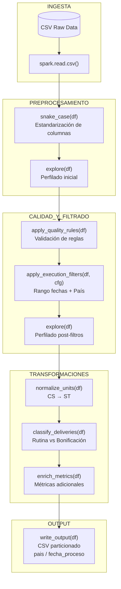

# PRUEBA TECNICA

Pipeline ETL desarrollado en PySpark para el procesamiento de datos de entregas de productos.  El flujo implementa buenas prácticas de ingeniería de datos: estandarización de columnas, control de calidad, filtrado parametrizado, transformación de unidades y generación de métricas.

---

## 📌 Requisitos

Antes de ejecutar el pipeline es necesario contar con:

- Python 3.9 o superior
- Apache Spark instalado y configurado (`spark-submit` disponible en PATH)
- Java 11 o 17
- Git

Instalar dependencias de Python:

```bash
pip install -r requirements.txt
```
---
## ⚙️ Configuración

La configuración del pipeline se define en un archivo YAML utilizando OmegaConf (`config/base.yaml`)

```yaml
paths:
  input_csv: data/raw/product_deliveries.csv
  output_base: data/processed

date_range:
  date_column: fecha_proceso
  start_date: 20250101
  end_date: 20250630

filters:
  country: PE
```
---
## ▶️ Run

El pipeline se ejecuta exclusivamente mediante el archivo `run_etl.py`

```bash
spark-submit run_etl.py --start-date 20250101 --end-date 20250630 --country PE
```
 `country` puede tomar los valores de `EC` (Ecuador), `GT` (Guatemala), `HN` (Honduras), `JM` (Jamaica), `PE` (Perú), `SV` (El Salvador)

El rango global de la `fecha_proceso` es `20250114` hasta `20250602`. Por lo tanto, `start-date` y `end-date` deberia estar entre esas fechas.

Para facilitar la revisión del flujo y visualizar únicamente los outputs relevantes del ETL (esquemas, muestras de datos, métricas y reportes), el pipeline puede ejecutarse utilizando una configuración de logging reducida.

```bash
spark-submit --conf "spark.driver.extraJavaOptions=-Dlog4j.configurationFile=log4j2.properties" run_etl.py --start-date 20250101 --end-date 20250630 --country PE

```
El archivo `log4j2.properties` controla el nivel de logging de Spark y se incluye en el repositorio para garantizar ejecuciones reproducibles y salidas legibles durante el desarrollo

---
## 🗂️ Estructura 
El proyecto está organizado bajo un enfoque modular para facilitar mantenibilidad, escalabilidad y separación de responsabilidades dentro del flujo ETL. La siguiente estructura refleja los distintos componentes del pipeline, desde la configuración y validación de datos hasta la generación de salidas particionadas.

```text
.
├── README.md
├── requirements.txt
├── run_etl.py
├── log4j2.properties
├── config
│   └── base.yaml
├── data
│   ├── raw
│   │   └── product_deliveries.csv
│   └── processed
│       ├── pais=PE
│       │   └── fecha_proceso=20250114
│       │       └── part-00000.csv
│       └── pais=GT
│           └── fecha_proceso=20250513
│               └── part-00000.csv
├── docs
│   └── enunciado_prueba.pdf
├── logs
└── src
    ├── main.py
    ├── config
    ├── filters
    │   └── selection.py
    ├── io
    │   └── writer.py
    ├── transformers
    │   ├── units.py
    │   ├── deliveries.py
    │   └── enrichment.py
    ├── utils
    │   ├── initial_explore.py
    │   ├── reporting.py
    │   └── snake_case.py
    └── validators
        └── quality.py

```
## EVALUACIÓN

A continuación se describe cómo cada requerimiento solicitado es abordado dentro del pipeline:

| Requerimiento | Implementación |
|--------------|----------------|
| Lectura de archivo CSV | Lectura mediante `spark.read.csv()` en `src/main.py` |
| Filtrado por rango de fechas | `filters/selection.py`, utilizando los parámetros `start-date` y `end-date` definidos vía `OmegaConf` |
| Parametrización por país | Argumento `--country` en `run_etl.py` |
| Uso de OmegaConf | La configuración del flujo (paths, fechas, países, factores de conversión y tipos de entrega) se centraliza en `config/base.yaml` |
| Particionado por fecha | `partitionBy("pais", "fecha_proceso")` en `io/writer.py` |
| Normalización de unidades (CS → ST) | En `transformers/units.py`, las cantidades expresadas en cajas (CS) se convierten a unidades (ST) utilizando un factor de conversión fijo de 1 CS = 20 ST, garantizando homogeneidad de escala y evitando duplicación de registros para análisis separados por tipo de entrega. |
| Clasificación de tipos de entrega | En `transformers/deliveries.py` se filtran únicamente los valores relevantes de tipo_entrega. ZPRE y ZVE1 se consideran entregas de rutina, mientras que Z04 y Z05 corresponden a bonificaciones. Otros valores se excluyen del output final. Asimismo, se generan las columnas `entrega_rutina_unidades` y `entrega_bonificacion_unidades`, asignando la cantidad normalizada según corresponda y cero en caso contrario. |
| Estandarización de nombres de columnas | Se aplica una transformación automática hacia la nomenclatura de `snake_case`en `utils/snake_case.py` inmediatamente después de la lectura del CSV, para asegurar consistencia semántica.|
| Detección y eliminación de anomalías |  En `utils/initial_explore.py` se genera un perfil del dataset previo a cualquier filtrado, calculando número de filas, rango de fechas y en `validators/quality.py` se aplican reglas explícitas de calidad: exclusión de registros con `fecha_proceso` o `pais` nulos, precios negativos o nulos, y cantidades menores o iguales a cero.|
| Generación de métricas | En `transformers/enrichment.py` se crea la métrica `total_value`, calculada como `cantidad_unidades * precio`, permitiendo tener un indicador para un análisis en el futuro.|

### DIAGRAMA DE FLUJO 


### OUTPUT

El pipeline genera un dataset procesado listo para consumo analítico, almacenado en formato **CSV** y particionado para facilitar consultas por país y fecha de proceso.

```text
data/processed/
├── pais=PE
│   └── fecha_proceso=YYYYMMDD
│       └── part-00000.csv
├── pais=GT
│   └── fecha_proceso=YYYYMMDD
│       └── part-00000.csv
```text


